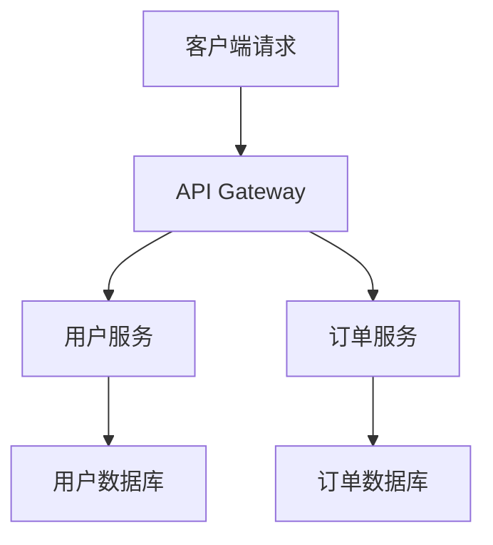

# 后端开发文章发布完全指南

作为后端开发者，分享技术知识和经验是职业发展的重要组成部分。本文将从多个维度详细介绍如何撰写和发布高质量的后端技术文章。

## 为什么后端开发者要写文章？

### 个人收益

1. **技术沉淀**：写作过程中深化对技术的理解
2. **个人品牌**：建立在技术社区的影响力
3. **职业发展**：提升表达能力和技术声誉
4. **知识分享**：帮助他人解决技术问题

### 社区价值

- 推动技术发展和最佳实践传播
- 降低其他开发者的学习成本
- 促进技术社区的知识积累
- 建立开发者之间的连接

## 文章类型和选题策略

### 技术教程类

**特点**：步骤详细，实用性强

**选题方向**：
- 新技术框架入门指南
- 复杂功能的实现教程
- 开发环境搭建指南
- 部署和运维实践

**示例**：
- "Spring Boot 微服务架构实战"
- "Docker 容器化部署完全指南"
- "Redis 缓存策略深度解析"

### 问题解决类

**特点**：针对性强，解决实际痛点

**选题方向**：
- 常见错误和解决方案
- 性能优化实践
- 调试技巧分享
- 架构设计问题

**示例**：
- "解决 MySQL 慢查询的 10 种方法"
- "Java 内存泄漏排查实战"
- "分布式系统中的数据一致性问题"

### 技术深度解析类

**特点**：理论深入，技术含量高

**选题方向**：
- 框架源码分析
- 算法和数据结构
- 系统设计原理
- 技术趋势分析

**示例**：
- "Spring IoC 容器源码深度解析"
- "分布式一致性算法 Raft 详解"
- "高并发系统架构设计思考"

## 内容创作流程

### 1. 前期准备

#### 确定目标读者
```
初级开发者：
- 注重基础概念解释
- 提供详细的代码示例
- 包含环境搭建步骤

中级开发者：
- 关注最佳实践
- 深入技术原理
- 提供性能优化建议

高级开发者：
- 架构设计思考
- 技术选型分析
- 前沿技术探讨
```

#### 技术验证
```bash
# 创建测试项目
mkdir article-demo
cd article-demo

# 验证技术方案
npm init -y
npm install express

# 编写示例代码
touch app.js
```

### 2. 文章结构设计

#### 标准结构模板

```markdown
# 文章标题

## 前言
- 问题背景
- 解决思路
- 文章价值

## 技术背景
- 相关技术介绍
- 前置知识要求
- 环境准备

## 核心内容
### 方案设计
### 代码实现
### 测试验证

## 进阶优化
- 性能优化
- 安全考虑
- 扩展性设计

## 总结
- 关键要点回顾
- 适用场景分析
- 后续发展方向
```

### 3. 代码示例编写

#### 完整可运行的示例

```javascript
// Express.js 基础 API 服务
const express = require('express')
const app = express()
const port = 3000

// 中间件配置
app.use(express.json())
app.use(express.urlencoded({ extended: true }))

// 路由定义
app.get('/api/users', async (req, res) => {
  try {
    // 模拟数据库查询
    const users = await getUsersFromDB()
    res.json({
      success: true,
      data: users
    })
  } catch (error) {
    res.status(500).json({
      success: false,
      message: error.message
    })
  }
})

// 启动服务
app.listen(port, () => {
  console.log(`Server running at http://localhost:${port}`)
})

// 模拟数据库操作
async function getUsersFromDB() {
  return [
    { id: 1, name: 'Alice', email: 'alice@example.com' },
    { id: 2, name: 'Bob', email: 'bob@example.com' }
  ]
}
```

#### 代码注释最佳实践

```python
# Python 异步编程示例
import asyncio
import aiohttp
from typing import List, Dict

class APIClient:
    """异步 API 客户端
    
    用于并发处理多个 HTTP 请求，提高数据获取效率
    """
    
    def __init__(self, base_url: str, timeout: int = 30):
        self.base_url = base_url
        self.timeout = aiohttp.ClientTimeout(total=timeout)
    
    async def fetch_user_data(self, user_ids: List[int]) -> List[Dict]:
        """并发获取多个用户数据
        
        Args:
            user_ids: 用户ID列表
            
        Returns:
            用户数据列表
            
        Raises:
            aiohttp.ClientError: 网络请求异常
        """
        async with aiohttp.ClientSession(timeout=self.timeout) as session:
            # 创建并发任务
            tasks = [
                self._fetch_single_user(session, user_id) 
                for user_id in user_ids
            ]
            
            # 等待所有任务完成
            results = await asyncio.gather(*tasks, return_exceptions=True)
            
            # 过滤异常结果
            return [result for result in results if not isinstance(result, Exception)]
    
    async def _fetch_single_user(self, session: aiohttp.ClientSession, user_id: int) -> Dict:
        """获取单个用户数据（私有方法）"""
        url = f"{self.base_url}/users/{user_id}"
        
        async with session.get(url) as response:
            response.raise_for_status()  # 检查HTTP状态码
            return await response.json()

# 使用示例
async def main():
    client = APIClient("https://api.example.com")
    user_ids = [1, 2, 3, 4, 5]
    
    # 并发获取用户数据
    users = await client.fetch_user_data(user_ids)
    print(f"获取到 {len(users)} 个用户数据")

if __name__ == "__main__":
    asyncio.run(main())
```

## 发布平台选择

### 技术社区平台

| 平台 | 特点 | 适合内容 | 用户群体 |
|------|------|----------|----------|
| 掘金 | 中文技术社区 | 前端、后端教程 | 中文开发者 |
| CSDN | 老牌技术博客 | 全栈技术文章 | 广泛开发者 |
| 知乎 | 问答社区 | 技术科普、经验分享 | 技术爱好者 |
| Medium | 国际平台 | 深度技术文章 | 国际开发者 |
| Dev.to | 开发者社区 | 开源项目、教程 | 欧美开发者 |

### 个人博客平台

**优势**：
- 完全控制内容和样式
- SEO 优化空间大
- 建立个人品牌

**技术选择**：
```bash
# 静态博客生成器
# Hexo (Node.js)
npm install -g hexo-cli
hexo init my-blog

# Hugo (Go)
brew install hugo
hugo new site my-blog

# VitePress (Vue)
npm create vitepress@latest
```

## 内容优化策略

### SEO 优化

```html
<!-- 文章元数据优化 -->
<head>
  <title>Spring Boot 微服务架构实战 | 技术博客</title>
  <meta name="description" content="详细介绍Spring Boot微服务架构设计和实现，包含完整代码示例和最佳实践">
  <meta name="keywords" content="Spring Boot,微服务,Java,后端开发">
  
  <!-- Open Graph 标签 -->
  <meta property="og:title" content="Spring Boot 微服务架构实战">
  <meta property="og:description" content="详细介绍Spring Boot微服务架构设计和实现">
  <meta property="og:image" content="/images/spring-boot-cover.jpg">
</head>
```

### 可读性提升

#### 1. 使用清晰的标题层级
```markdown
# 一级标题：文章主题
## 二级标题：主要章节
### 三级标题：具体内容
#### 四级标题：细节说明
```

#### 2. 合理使用代码块
```java
// ✅ 好的代码示例：有注释，逻辑清晰
@Service
public class UserService {
    
    @Autowired
    private UserRepository userRepository;
    
    /**
     * 根据用户ID获取用户信息
     * @param userId 用户ID
     * @return 用户信息
     */
    public User getUserById(Long userId) {
        return userRepository.findById(userId)
            .orElseThrow(() -> new UserNotFoundException("用户不存在: " + userId));
    }
}
```

#### 3. 添加图表和流程图


### 互动性增强

#### 1. 提供完整的项目代码
```bash
# GitHub 仓库结构
spring-boot-microservice-demo/
├── user-service/
│   ├── src/main/java/
│   ├── src/main/resources/
│   └── pom.xml
├── order-service/
├── api-gateway/
├── docker-compose.yml
└── README.md
```

#### 2. 设置讨论话题
> **思考题**：在微服务架构中，如何处理分布式事务？你有哪些实践经验？欢迎在评论区分享！

## 推广和运营

### 社交媒体推广

```markdown
# 微博/Twitter 发布模板
🚀 新文章发布：《Spring Boot 微服务架构实战》

📝 内容包括：
✅ 微服务设计原则
✅ Spring Cloud 组件使用
✅ 完整项目示例
✅ 部署和监控

🔗 阅读链接：[文章链接]

#SpringBoot #微服务 #Java #后端开发
```

### 技术社区互动

1. **及时回复评论**：解答读者疑问
2. **参与讨论**：在相关话题下分享观点
3. **系列文章**：建立内容体系
4. **技术分享**：参加线上/线下活动

### 数据分析和优化

```javascript
// Google Analytics 事件追踪
gtag('event', 'article_read', {
  'event_category': 'engagement',
  'event_label': 'spring-boot-microservice',
  'value': 1
});

// 文章阅读时长统计
let startTime = Date.now();
window.addEventListener('beforeunload', () => {
  const readTime = Date.now() - startTime;
  gtag('event', 'reading_time', {
    'event_category': 'engagement',
    'event_label': 'spring-boot-microservice',
    'value': Math.round(readTime / 1000)
  });
});
```

## 常见问题和解决方案

### 1. 技术深度 vs 可读性

**问题**：如何平衡技术深度和文章可读性？

**解决方案**：
- 分层次介绍：基础概念 → 核心实现 → 高级优化
- 提供多个入口：快速开始 + 深度解析
- 使用渐进式披露：先展示结果，再解释原理

### 2. 代码示例的完整性

**问题**：代码示例过于简化或过于复杂

**解决方案**：
- 提供最小可运行示例
- 完整项目放在 GitHub
- 关键代码在文章中详细解释

### 3. 技术更新频率

**问题**：技术栈更新导致文章过时

**解决方案**：
- 定期更新热门文章
- 在文章开头标注版本信息
- 建立文章维护计划

## 成功案例分析

### 案例1：阮一峰的技术博客

**成功要素**：
- 定期更新（每周技术分享）
- 内容通俗易懂
- 涵盖面广（前端、后端、工具）
- 个人风格鲜明

### 案例2：美团技术团队博客

**成功要素**：
- 实战经验分享
- 大规模系统架构
- 性能优化案例
- 团队协作产出

## 总结

后端开发者写技术文章是一个系统性工程，需要从以下几个方面持续努力：

### 内容质量
1. **技术准确性**：确保代码可运行，方案可行
2. **逻辑清晰**：结构合理，层次分明
3. **实用价值**：解决实际问题，提供可操作的方案

### 表达能力
1. **语言组织**：简洁明了，避免冗余
2. **代码规范**：注释完整，命名清晰
3. **视觉呈现**：合理使用图表、代码高亮

### 持续运营
1. **定期更新**：保持内容新鲜度
2. **社区互动**：积极回应读者反馈
3. **个人品牌**：建立技术影响力

记住，优秀的技术文章不仅能帮助他人，也是自己技术成长的重要途径。从今天开始，记录你的技术思考，分享你的开发经验，让知识在分享中增值！